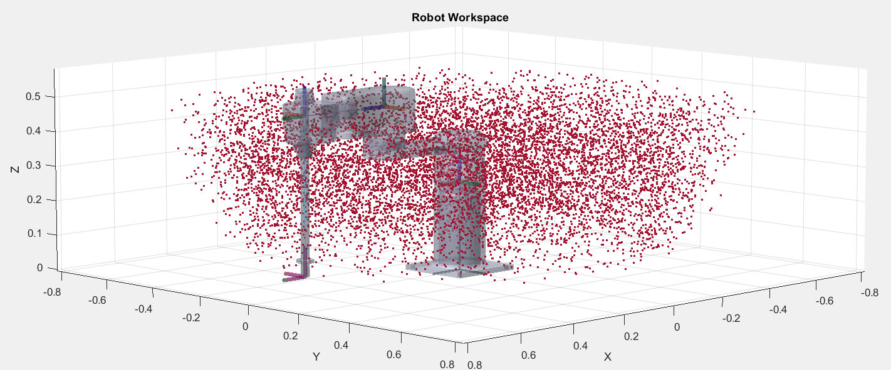
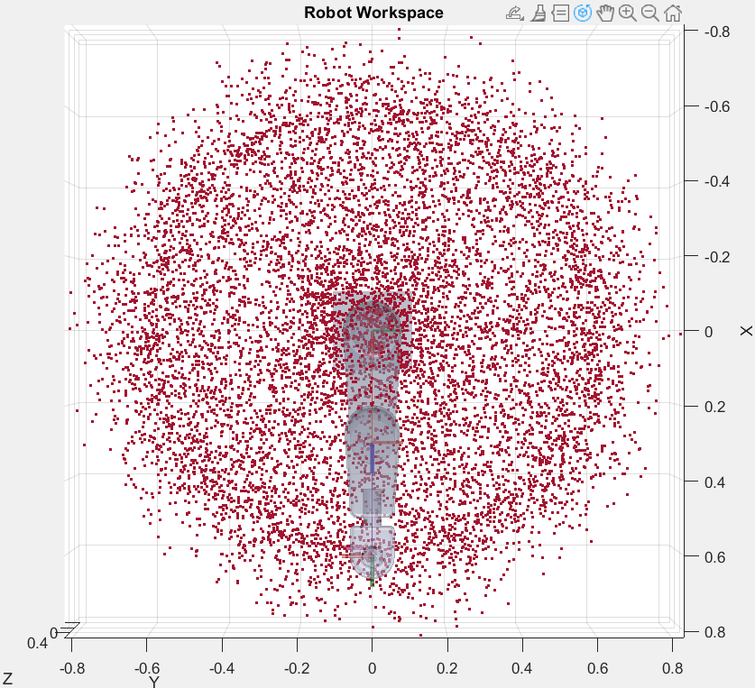
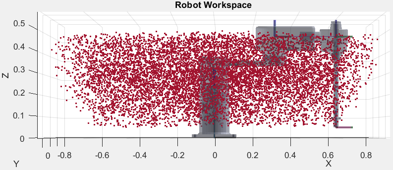
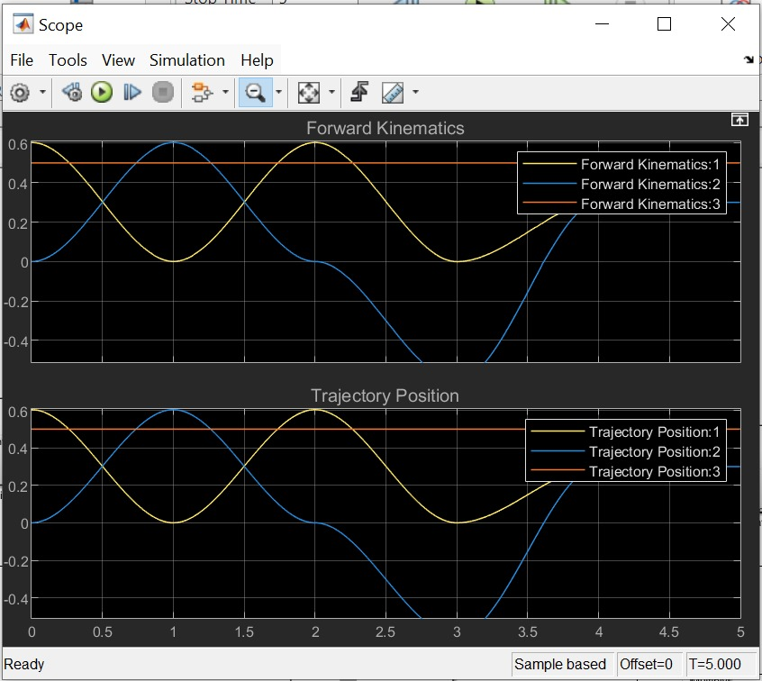
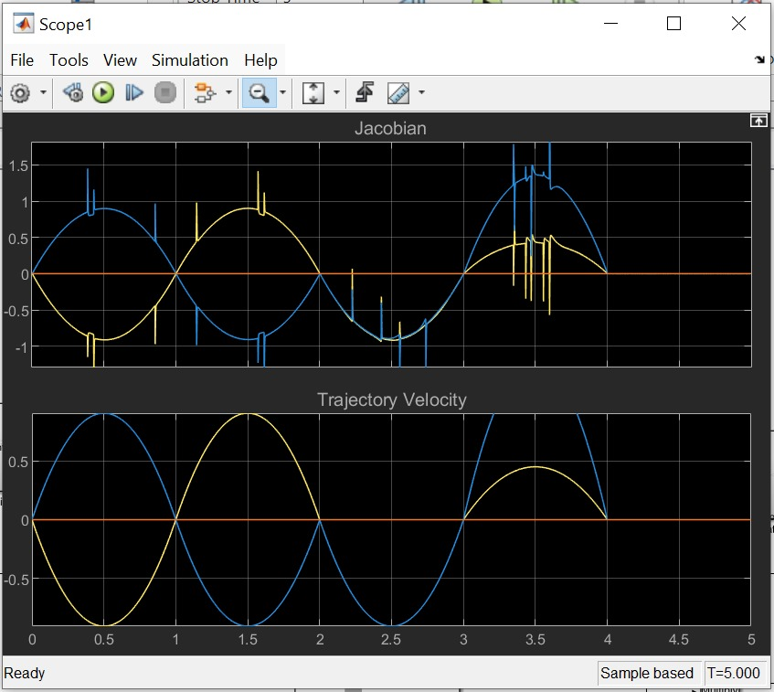

## Payload Estimation 
Each link must be able to withstand the stresses that are imposed by the payload.  

Apply the bending stress equation to each link:  

$$\sigma = \frac{M \cdot c}{I}$$

σ: Bending stress in the link (Pa).  
𝑀: Bending moment due to payload and link mass.  
𝑐: Distance from the neutral axis to the outermost fiber (depends on link cross-section).  
𝐼: Second moment of area of the link cross-section.  

The bending stress 𝜎 must not exceed the yield strength of the link material:  
𝜎 ≤ 𝜎yield

## Robot's Reach / Range of Motion
The range of motion of the end effector, also known as robot's reach, can be found analytically but also demonstrated using software such as MATLAB:

  

  

  

For this demonstration a sample of 10000 random robot configurations has been used to plot the end effector position at each of these configurations.

## Simulation Results

## Kinematic Graphs
### Position Trajectory and Forward Kinematics

  

### Velocity Trajectory and Jacobian

  

