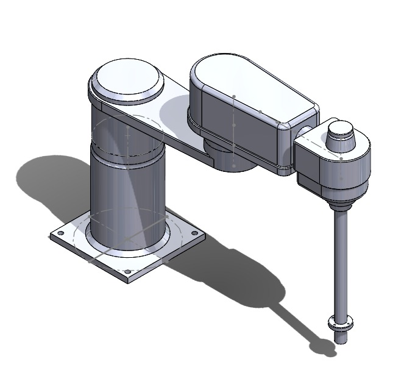
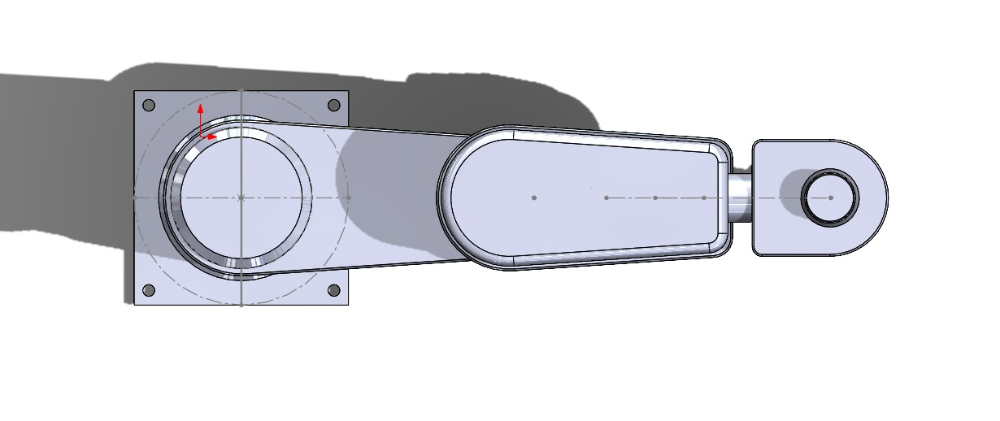

# Robot Design & CAD
The robot design has been defined analytically, considering the real applications for which was developed. 

Kinematics:
Joints:
- Joint 0: Fixed.
- Joint 1: Revolute.
- Joint 2: Revolute.
- Joint 3: Revolute.
- Joint 4: Revolute.
- Joint 5: Prismatic

Links:
- Link 0 (base link): Does not add any limitation for the robot movement, but contributes to the vertical (z axis of base) range.
- Link 1: Contributes in range and allows movement normal and away from the base z axis direction.
- Link 2: Allows the movement towards the base and contributes to the movement normal and away from the base z axis direction.
- Link 3: The link rotates holding link 4 and limiting its motion.
- Link 4: Allows and sets the maximun range at the base z axis direction, also rotates for manipulability.
- EE (end effector): Attached to the end of link 4, can be defined and adapted for a particullar use.

Isometric View of Assembly:

  

  

  

  

