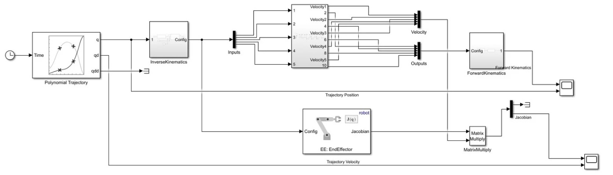
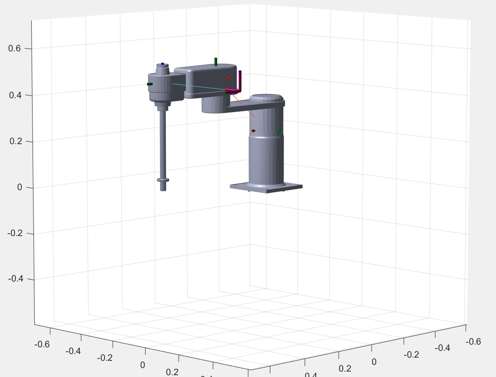

# Mathematical Models

## Robot's Block Diagram (Simulink)
<p align="center">
  
</p>

## Forward Kinematics
### Simulink

<p align="center">
  
</p>

### DH Parameters

<p align="center">
  
</p>

| a   | alpha  | d   | theta             |
|-----|--------|-----|-------------------|
| 0   | 0      | L1  | 0                 |
| L3  | 0      | L2  | theta1            |
| 0   | π/2    | 0   | theta2 + π/2      |
| L4  | π/2    | 0   | theta3 + π        |
| 0   | 0      | 0   | theta4            |
| 0   | 0      | L5  | 0                 |

MATLAB
```
% Forward Kinematics
% General DH Transformation Matrix
function T = DHTransformationMat(a, alpha, d, theta)
    T = [cos(theta) -sin(theta)*cos(alpha) sin(theta)*sin(alpha) a*cos(theta);
        sin(theta) cos(theta)*cos(alpha) -cos(theta)*sin(alpha) a*sin(theta);
        0 sin(alpha) cos(alpha) d;
        0 0 0 1];
end

syms theta1 theta2 theta3 theta4 ;
syms L1 L2 L3 L4 L5 L6;

% Robot DH Table
DH_table = [0,      0,      L1,     0;
            L3,     0,      L2,     theta1;
            0,      pi/2,   0 ,     theta2 + pi/2;
            L4,     pi/2,   0,      theta3 + pi;
            0,      0,      0,      theta4;
            0,      0,      L5      0];

T01 = DHTransformationMat(DH_table(1, 1), DH_table(1, 2), DH_table(1, 3), DH_table(1, 4));
T12 = DHTransformationMat(DH_table(2, 1), DH_table(2, 2), DH_table(2, 3), DH_table(2, 4));
T23 = DHTransformationMat(DH_table(3, 1), DH_table(3, 2), DH_table(3, 3), DH_table(3, 4));
T34 = DHTransformationMat(DH_table(4, 1), DH_table(4, 2), DH_table(4, 3), DH_table(4, 4));
T45 = DHTransformationMat(DH_table(5, 1), DH_table(5, 2), DH_table(5, 3), DH_table(5, 4));
T56 = DHTransformationMat(DH_table(6, 1), DH_table(6, 2), DH_table(6, 3), DH_table(6, 4));

% Cumulative transformation matrices
T1 = T01;                  % Joint 1
T2 = T1 * T12;             % Joint 2
T3 = T2 * T23;             % Joint 3
T4 = T3 * T34;             % Joint 4
T5 = T4 * T45              % Joint 5
T6 = T5 * T56              % Joint 6

T6 = simplify(T6)
```


## Rigid body tree
```
%Import the robot from URDF
robot = importrobot('ROBOT_/urdf/ROBOT_.urdf');

%Add gravity
robot.Gravity = [0 0 -9.80665];

%Add another massless coordinate frame for the end-effector
eeOffset = -0.450;
eeBody = robotics.RigidBody('EE');
eeBody.Mass = 0;
eeBody.Inertia = [0 0 0 0 0 0];
setFixedTransform(eeBody.Joint,trvec2tform([eeOffset 0 0]));
addBody(robot,eeBody,'link4');

%Display robot details
showdetails(robot);
show(robot)
```
<p align="center">
  
</p>


## Inverse Kinematics (Simulink)

<p align="center">
  
</p>

## Jacobian

<p align="center">
  
</p>

## Trayectory
<p align="center">
  
</p>


